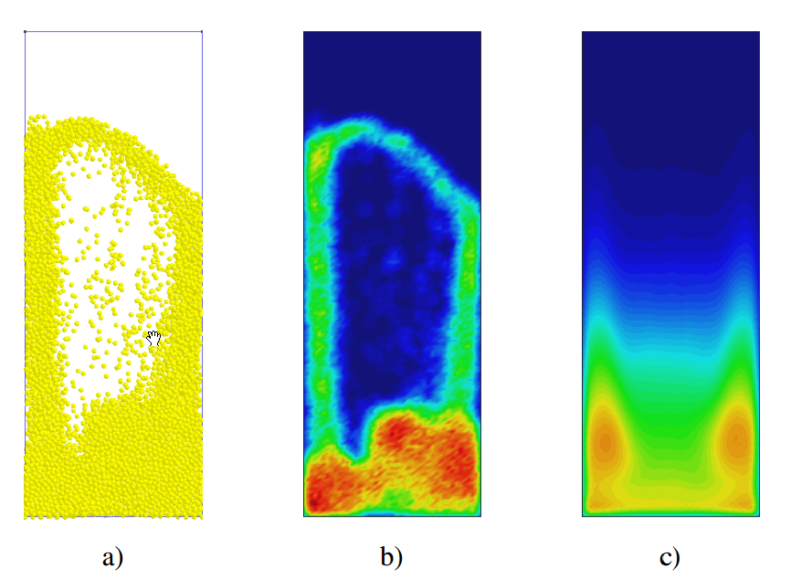

# Introduction

In most cases where DEM is used, it is necessary to carry out some averaging of the data to a more representative scale of what is required.
As such it is quite common for spatial averaging, temporal averaging or both to be applied to the DEM data.
To aid the process, a toolbox for the processing of DEM data both temporally and spatially has been implemented in the University of Edinburgh.
The toolbox has been developed to support many codes such as EDEM, PFC, DEMPack and LAMMPS and provides a simple interface for the averaging
process for the large datasets that DEM simulations produce.
The toolbox provides both a coarse graining method for projecting the results on to a continuum field and a binning method.
A study of the effect of both temporal and spatial averaging using this toolbox is presented in [4] and some of the results are shown in Figure 1.1.
Full details of the methods implemented in the toolbox are available in several papers [1, 2, 3, 5].
The coarse-grained density ρ is provided by equation:

where **r** is a point in space where the values are to be evaluated, **r**(t)_i is the vector of the centres of mass of the particles at a given timestep t,
and φ is the coarse graining function which is subject to the condition of its integral over space being unity.

The coarse-grained velocity V is provided from equation 

where **p** is the coarse-grained momentum density.

The stress tensor is given by equation

where *f_ijα* is the interaction force between two particles, *r_ijβ* is the branch vector, *s* is the integral of the
branch vector and *v'* is the fluctuating velocity of the particle.

*Figure 1.1. P4 toolbox in use - Post-processing on a fluidised bed [4]. a) Particles visualization.
b) Spatial averaged density. c) Spatial and temporal averaged density over 20 sec.*

The P4 Toolbox is implemented within GiD, which is a pre and post-processor software package for numerical simulations.
Detailed manuals for GiD are located at [http://www.gidhome.com/support/manuals](http://www.gidhome.com/support/manuals) while
some tutorials are available at [http://www.gidhome.com/support/tutorials](http://www.gidhome.com/support/tutorials).
GiD is available on a selection of computers but a trial version of the software can be downloaded and used for a three month period on any computer.

