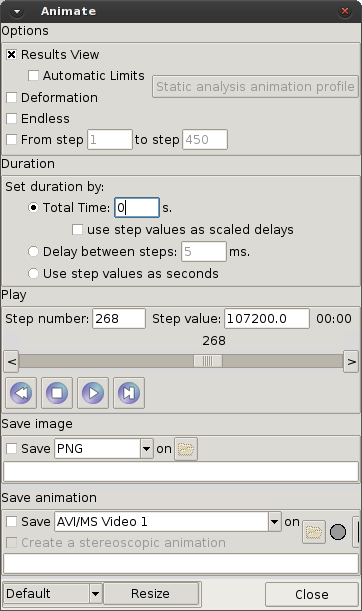

# Animations tool

This window lets you create an animation of the current Results View, where the limits can be fixed
along the animation with Automatic Limits, and/or an animation of the Deformation of the meshes. To
the right of the Step: label, the step value is shown. On the slide bar, the step number is shown.

