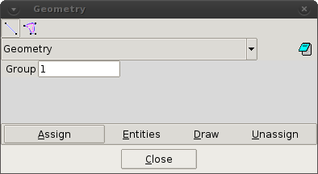

# Assign geometry/surface condition

This command allows the user to select elements/surfaces that are physical walls, for the calculation of
pressure and drag force.

The condition can be assigned over lines ( ) or surfaces ( ).

* **Group.** This option allows to assign the line/surface to a different group for the post-process.