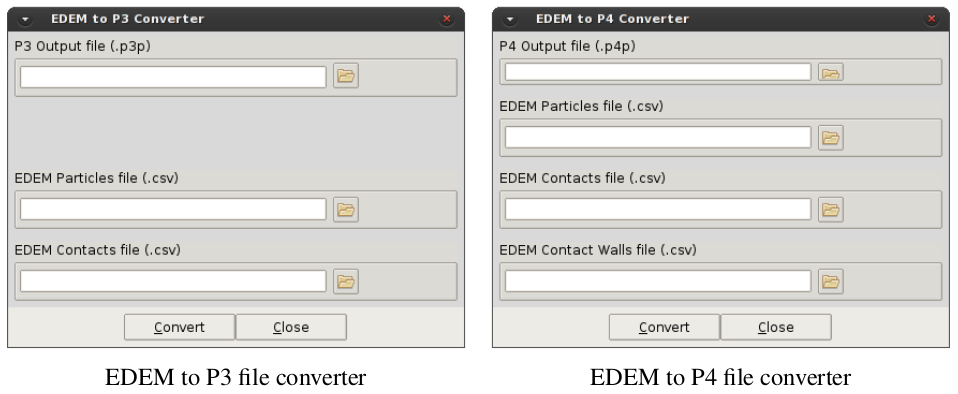
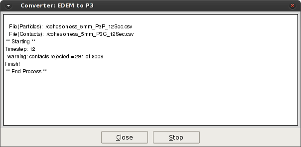

## Using P4 with EDEM

While EDEM has a post-processing tool included in the Analyst, it’s abilities are limited. Visualisations
and movies can be made easily, but the information displayed is limited to particle properties such as
velocity and angular velocity. Force chain networks are also easily visualised with the option to apply
colour-maps to the network also.

The graphing tool is limited to plotting a single value at a time. Checking multiple pieces of data requires
external post-processing.

In order to calculate stress, strains and other values for an assembly we use the P4 toolbox.

## Data Export

EDEM currently does not support exporting directly to the P4 file format so data needs to be exported
from EDEM using a normal .csv file with a specific set of queries to provide the necessary data. Details
on setting up query configurations can be found in the EDEM manual.

For spherical particles only the P3 file for particles (.p3p) and for all contacts (.p3c) are required. These
queries are detailed in A.1. In the case of non-spherical, clustered particles, the ID of the two contacting
particles is also required for the output. In this case data files of the P4 type are exported. These are
detailed in A.2 for particles (.p4p), particle-particle contacts (.p4c) and for all particle-geometry contacts
(.p4w).

In order to provide the ID for particles in contact, an additional API contact model has been written to
determine and store the necessary contact data. The **Track_ID API contact model** (available as either a
windows .dll file or linux .so file) must be loaded for both particle-particle interactions and particle-wall
interactions to generate P4 file types.

> NOTE:
> While it is possible to us the P4 Toolbox for spherical particles using the P3 export configuration,
> that is the simulation is run without the Track_ID API to reduce the simulation run-time, doing
> this may lead to errors. Due to the limitations in the export formatting in EDEM, consistent and/or
> sufficient level of significant figures in the coordinates may lead to the rejection of a certain number
> of contacts when the exported EDEM file is being converted. The P4 converter will automatically
> increase the tolerance to accept all particle-particle and particle-wall contact and display a warning
> message detaining how many ambiguous contacts were found.

The P4 toolbox has the minimum requirement listed in the A.1 and A.2 but also supports additional
queries. An example of such additional queries is highlighted in A.1 and A.2 where the queries marked
with an * represent additional queries of interest for particle data If the X, Y and Z components are
provided, the magnitude will also be calculated and averaged. If all three components are not found the
items will treated as individual scalars.

*Table 1. P3 Export Queries*

| P3P File                          | P3C File                        |
|:----------------------------------|:--------------------------------|
| Q01:Total Number of Particles:    | Q01:Total Number of Contacts:   |
| Q02:Particle ID:                  | Q02:Contact Vector 1 X:         |
| Q03:Particle Volume:              | Q03:Contact Vector 1 Y:         |
| Q04:Particle Mass:                | Q04:Contact Vector 1 Z:         |
| Q05:Particle Position X:          | Q05:Contact Vector 2 X:         |
| Q06:Particle Position Y:          | Q06:Contact Vector 2 Y:         |
| Q07:Particle Position Z:          | Q07:Contact Vector 2 Z:         |
| Q08:Particle Velocity X:          | Q08:Contact Position X:         |
| Q09:Particle Velocity Y:          | Q09:Contact Position Y:         |
| Q10:Particle Velocity Z:          | Q10:Contact Position Z:         |
| *Q11:Particle Angular Velocity X: | Q11:Contact Normal Force X:     |
| *Q12:Particle Angular Velocity Y: | Q12:Contact Normal Force Y:     |
| *Q13:Particle Angular Velocity Z: | Q13:Contact Normal Force Z:     |
|                                   | Q14:Contact Tangential Force X: |
|                                   | Q15:Contact Tangential Force Y: |
|                                   | Q16:Contact Tangential Force Z: |

*Table 2. P4 Export Queries*

| P4P File                          | P4C File                          | P4W File                          |
|:----------------------------------|:----------------------------------|:----------------------------------| 
| Q01:Total Number of Particles:    | Q01:Total Number of Contacts:     | Q01:Total Number of Contacts:     |
| Q02:Particle ID:                  | Q02:Contact IDfirst:              | Q02:Contact IDfirst:              |
| Q03:Particle Volume:              | Q03:Contact IDsecond:             | Q03:Contact Position X:           |
| Q04:Particle Mass:                | Q04:Contact Position X:           | Q04:Contact Position Y:           |
| Q05:Particle Position X:          | Q05:Contact Position Y:           | Q05:Contact Position Z:           |
| Q06:Particle Position Y:          | Q06:Contact Position Z:           | Q06:Contact Normal Force X:       |
| Q07:Particle Position Z:          | Q07:Contact Normal Force X:       | Q07:Contact Normal Force Y:       |
| Q08:Particle Velocity X:          | Q08:Contact Normal Force Y:       | Q08:Contact Normal Force Z:       |
| Q09:Particle Velocity Y:          | Q09:Contact Normal Force Z:       | Q09:Contact Tangential Force X:   |
| Q10:Particle Velocity Z:          | Q10:Contact Tangential Force X:   | Q10:Contact Tangential Force Y:   |
| *Q11:Particle Angular Velocity X: | Q11:Contact Tangential Force Y:   | Q11:Contact Tangential Force Z:   |
| *Q12:Particle Angular Velocity Y: | Q12:Contact Tangential Force Z:   |                                   |
| *Q13:Particle Angular Velocity Z: |                                   |                                   |

## File Conversion

In order to carry out post-processing with the P4 Toolbox, the data exported from EDEM needs to be
converted into the file format used by the P4 Toolbox. The P4 toolbox comes with an inbuilt converter
which converts the .csv files exported from EDEM to the required P3 or P4 files for use in the toolbox.
The converter can be selected as shown in 3.1. Upon selection, the option to convert to either P3 or P4
files is displayed in the *P4 toolbox* submenu as:

Selecting either option displays an input box such as those presented in A where the EDEM input files
and P3/P4 output files are specified. Once the files have been correctly selected, the conversion process
is started by pressing the convert button. Pressing the convert button will open the info window (A),
which provides details of the conversion for each timestep as the files are being processed.

Once the files have been converted to the P3/P4 file format, the data can then be used with the P4 Toolbox
for advanced post-processing of the data. Calculation and post-processing of the data can only take place
if a mesh of nodes has been created within GiD. This will be discussed in the following section.

> NOTE:
>
> During the file conversion process, it is possible that some contacts will be rejected such as shown
> in the file conversion Info window. However, only contacts that occur between virtual-virtual
> particles and virtual particles-geometry will be rejected. Virtual particles are generated in the case
> where periodic boundaries are employed in the simulation and this is the only time contacts should
> be rejected.

*EDEM to P3/P4 file converter info window*

