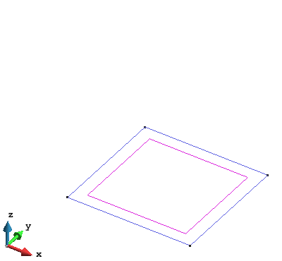
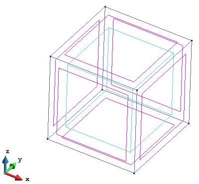
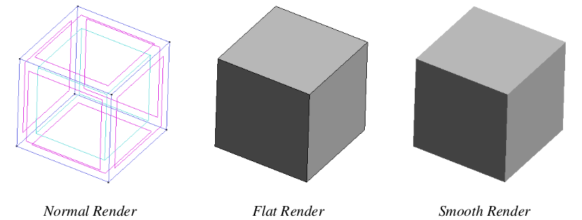
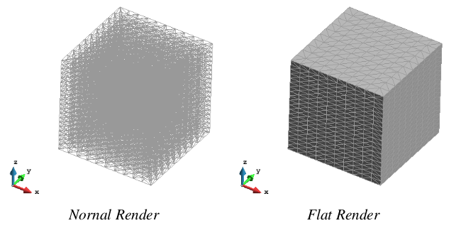
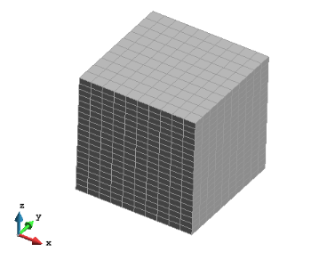

# Generating a model

The GiD preprocessing capabilities allows the user to generate and import the geometry and/or mesh to
be used for the analysis.

To import a geometry or mesh, different format are accepted. The most common format for geometry are *IGES*, *PARASOLID* and *DXF*.
A detailed explanation of the import procedure can be found in: `Menu > Help > Tutorials > Importing Files > Importing in GiD`.

To generate a geometry from the scratch on GiD, the toolbar *Geometry & View*, located at the left of the screen can be used, or through the menu: `Menu > Geometry`.
The detail of all available geometrical operations (generating, manipulating and deleting entities) can be found in:
`Help > Preprocessing > Geometry Menu`.
A useful command for simple geometries is the generation of geometrical objects, where the most common objects can be created in a simple way:
`Menu > Geometry > Create > Object`.

Below, an examples of the required command to generate a cube (2.0 x 2.0 x 2.0) is presented:

* Select the basic geometry: `Geometry > Create > Object > Rectangle`

* First corner point: *(0.0 0.0 0.0)*. Second corner point: *(2.0 2.0 0.0)*. Press `ESC` keyword to finish.

* Extrude the square to generate a cubic volume: `Menu > Utilities > Copy`.

* In the *Copy* windows, select: Entity = Surface, Tansformation = Translation, Do_Extrude = Volumes, First point = *(0.0 0.0 0.0)*, Second point = *(0.0 0.0 2.0)*.

* Press *Select* and with the mouse click over the surface in the screen. Press *Finish* to finish or *ESC*.

* To change the render of the geometry use `Menu > View > Render` or the *Mouse Menu* (right button).

## Meshing the geometry

Ones the geometry is created, can be discretized using different unstructured, structured or semi-
structured mesh elements. The detail of all the meshing options can be found in `Help > Preprocessing > Mesh Menu`.

Using the previous example, the instructions to generate a structured mesh of tetrahedral elements with 10 elements in X and Y directions, and 20 elements in Z direction:

* Select structured mesh: `Menu > Mesh > Structured > Volume > Assign number of cells`.

* With the mouse, click the volume in the screen ().

* Enter the number of cells/elements in for X and Y directions: 10, and Assign clicking over one line
following X direction and one line following Y direction. *ESC* to finish.

* Enter the number of cells/elements in for Z direction: 20, and Assign clicking over one line following
Z direction. *ESC* to finish.

* Generate the mesh by: `Menu > Mesh > Generate`. As the structured condition for the mesh has been
assigned over the geometry, the *Element size* asked in the *Mesh generation* windows will not have effect over our mesh. Click OK.

* Ones the mesh is generated, click *View mesh* to visualize the mesh. Change the render to *Flat* for a better visualization of the mesh.

* The tetrahedra is the default type of 3D element in GiD. To use Hexahedra (Prism is reserved for
semi-structured meshes), change the element type in: `Menu > Mesh > Element type > Hexahedra`,
and click over the volume to assign the type and ESC to finish. Now generate again: `Menu > Mesh > Generate`.

> Note:
> 
> * For the processing with P4, structured or semi-structured meshes are recommended.
> * The element/cell size do NOT have any influence in the precision of the averaged values, and is
just related with the resolution (number of points) of the mesh where the values are projected.
> *  As the resolution of the averaged values is just related with the amount of points/nodes in
the mesh, can be useful the use of quadratic elements in the mesh to minimize the number
of elements required maintaining the number of nodes. This is useful to decrease the output
file size and for a better visualization. To activate the quadratic elements: `Menu > Mesh >
Quadratic type > Quadratic`.

