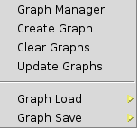
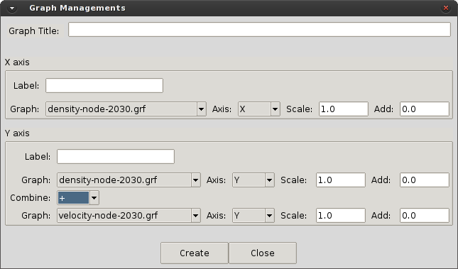

# Graph manager

This command displays a sub-menu to create/edit/save graphs.

<!-- *Figure. Example of P4 Toolbox within GiD.* -->

* **Graph Manager.** Open the Graphs Manager of GiD. (See GiD help on Graphs manipulation: `Menu > Windows > View graphs`)

* **Create Graph.** Open the Graphs Creation window. This command is used to create a new graph as a combination of existing graphs.

  

* **Clear Graphs.** This option clean the graphs buffer in GiD.

* **Update Graphs.** Update the list of graphs in the menu.

* **Graph Load.** Display the list of graphs available in the project to be loaded.

* **Graph Save.** Display the list of graphs in the graph buffer (plotted in the graph window) and save the selected graph.