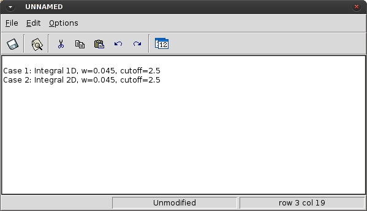

# Notes

This option allows the user to add notes related with the model. It is useful when working with large
models where much information is defined or when working with a set of models where just one
parameter (i.e: the material density or the time step) differs from each other.

