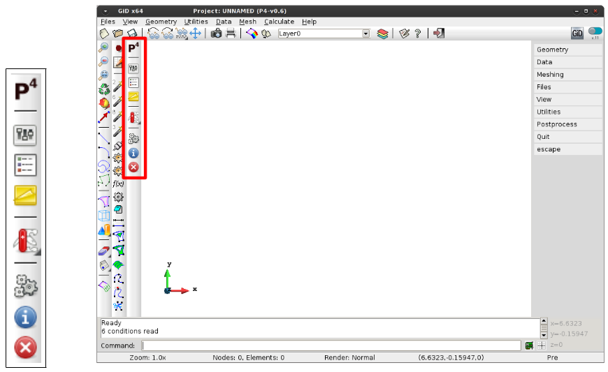

 # Preparing post-processing

Once the P4 problemtype is started, GiD will display a new toolbar at the left (or top) of your GiD main
screen, as shown in Fig 3.1.

*Figure 3.1. Example of P4 Toolbox within GiD.*

The description of the different commands in the toolbar is presented below:

| | |
|:-------:|:------|
|       | **P4 help.** |
|   | **Processing options.** Define input files and averaging method. |
|   | **Assign geometry/surface condition.** |
|      | **Notes.** Used to record notes on options such as averaging widths or grid size, etc. |
|      | **Toolbox.** EDEM Converter: Convert EDEM data files to P3/P4 files. |
|   | **Start Processing.** |
|   | **View Info.** Info for current process. |
|   | **Stop Processing.** |

#### Contents:

* [Generating a model](post_generating_a_model.md)
* [Processing options](post_processing_options.md)
* [Assign geometry/surface condition](post_assign_geo_and_conditions.md)
* [Notes](post_notes.md)
* [Toolbox](post_toolbox.md)
* [Processing control](post_processing_control.md)
