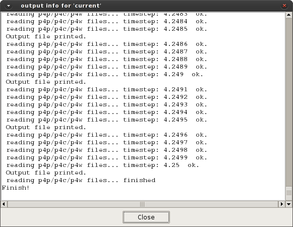

# Processing control

The process control is defined by 3 main commands to execute (), show info () and cancel () the execution of P4.

* **Start Process.** Initiate the processing of the simulation results. Check the setting and launch the process.

* **View Run Info.** Shows a window with the evolution of the process, as in Figure below.

* **Cancel Process.** Stop the execution. All the processed result until stop the process can be visualized in
the post-process.