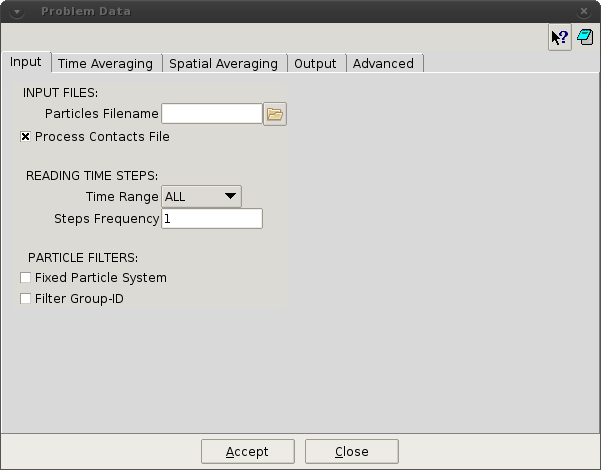

## Input

This section is used for the definition of the particles files to be processed. The files can be selected and
filtered by time ranges, steps frequency and particle groups.

##### INPUT FILES

* **Particles Filename.** This options allows the user to chose the input (.p3p/.p4p) file to be processed. In
the case of the experimental liggghts dump file, the file extension expected is (.p).

* **Process Contact Files.** [on/off] This options activates the processing of particle-particle and particle-
wall contact files if they are detected. P4 assumes that contact files have the same name that the particle
files, with extensions .p3c and .p3w

##### READING TIME STEPS

* **Time Range.** [ALL / CUSTOM] This option allows the user to chose all time steps in the input files
(ALL), or define a custom time range (CUSTOM).

* **TimeStart.** When CUSTOM Time Range is chosen, define the time to initiate the input file processing.

* **TimeEnd.** When CUSTOM Time Range is chosen, define the time to finish the input file processing.

* **Steps Frequency.** Chose the frequency for reading the time steps from the input files.

##### PARTICLE FILTERS

* **Fixed Particle System.** [on/off] Indicate to P4 that the number of particles and IDs are fixed for the
duration of the simulation being analysed.

* **Filter Group-ID.** [on/off] This option is used to indicate that a specific group ID of particles will be
processed.

* **Use Group-ID.** When Filter Group-ID activated, indicate the group ID of particles to be processed.
