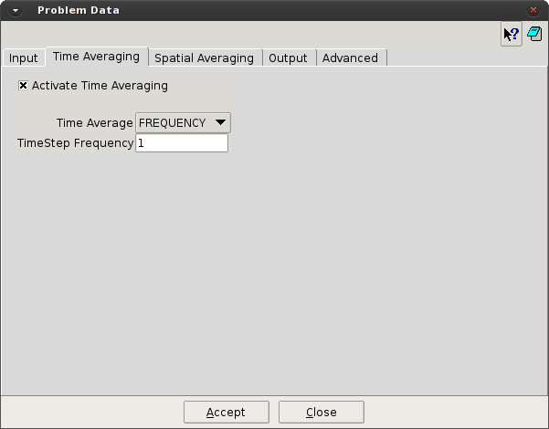

# Time Averaging

This section allows the activation of the temporal average processing. The average can be chosen for all
the results loaded or local time ranges.

* **Activate Time Average.** [on/off] This option activates the averaging process in the time domain.

* **Time Average.** [ALL / FREQUENCY] Chose if the time average will be performed over all the
simulation (ALL) or using a local time average for a number of time steps (FREQUENCY).

* **TimeStep Frequency.** The number of steps used for the local time average.