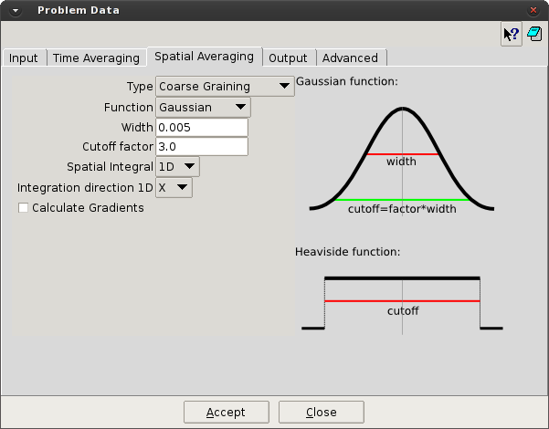

# Spatial Averaging

this section is used for the definition of the spatial average processing. Allows the user chose between
Binning (cell-based averaged values) or Coarse graining (point-based average values), and for the case
of Coarse graining, activate the calculation of gradients and spatial integrals.

* **Type.** [Coarse_Graining / Binning] The type of spatial averaging can be chose as Coarse Graining or Binning. (See below for details)

* **Function.** [Heaviside / Gaussian] When Coarse Graining is chosen, the spatial average function can be chosen between Heaviside and Gaussian functions.

* **Width.** For Gaussian function, the Width is the standard deviation of the function.

* **Cutoff factor.** For Gaussian function, the Cutoff factor define the total length of the function, as a factor (>1) of the standard deviation.
As the Gaussian function is infinite, the cutoff will define the maximum range of action for the spatial average.

* **Cutoff.** For Heaviside function, the Cutoff defines the range of action of the function to consider the surrounding particles in the spatial average.

* **Spatial integral.** [NO / 1D / 2D] Allows the user to perform the integral of the spatial average. In 1D
integral, all the particles in the integral direction are used to compute the spatial average, resulting in a
projection over the plane. In the 2D integral, all the particles in the range of the integral planes are used to
perform the spatial average, resulting in a projection over the line. *[NEED A BETTER EXPLANATION]*

* **Integration direction.** [X / Y / Z] When Spatial Integral 1D activated, define the integration direction.

* **Integration plane.** [XY / YZ / XZ] When Spatial Integral 2D activated, define the integration plane.

* **Calculate Gradients.** [on/off] Activate the calculation of spatial gradients during the averaging process.
The gradients will be chosen in results menu for the standard results: Density, Solid fraction, Momentum,
and Velocity.

> Note:
>
> * For most of the cases, the use of Coarse_Graining averaging procedure with Gaussian function
is recommended. Binning averaging and Coarse_Graining with Heaviside function are used just
for special cases, because their limitation of capabilities.
> *  For the Gaussian function, the values of Width and Cutoff_factor are problem dependent, but
for quasi-static problems or low speed flows a Width of 2.5-3.0 times the average particle radius
can be considered a safe value. For high speed flows and high sampling frequencies, this value
can decrease until 0.5 times the average radius. The Cutoff_factor of 3.0 can be considered safe.
In case of high speed flows or sampling frequencies, this value can decrease to obtain a better
resolution close to the boundaries.