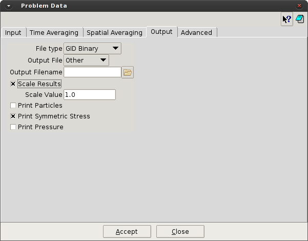
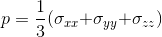

# Output

This section is used to define the output generation from P4. Allows activate the particles/contacts
visualization files, activate special results or scale the results.

* **File Type.** [GiD_Binary / GiD_Ascii] Allows to chose the type of output/post-process file written in P4.
The binary file reduce the file size, but no problems can be checked in the file. The Ascii file, allows to
access and read the results directly in a text editor, but increase the file size.

* **Output File.** [Default / Other] Allows the user to use the default name for the output file (DEFAULT)
or define a different one (OTHER).

* **Output Filename.** When Other Output File is chosen, define the user name for the output/post-process
file.

* **Scale Results.** [on/off] Used to scale the results of P4. This option, combined with the spatial integrals,
is useful to calculate the average in a certain direction or plane.

* **Scale Value.** When Scale Results is activated, define the value used to scale the results.

* **Print Particles.** [on/off] Used to write an extra output file with the particles information. This is required
to visualize the particles in the post-processor, but increase the processing time.

* **Print Particles Contact.** When Print Particles is activated, this option is used to add the contact
information in the particles output file.

* **Print Symmetric Stress.** [on/off] Normally, the stress calculated in P4 produce a non-symmetric tensor
and the 9 components of the tensor should be written. This option is used to force the symmetry in the
stress tensor, and just 6 components are required.

* **Print Pressure.** [on/off] This option is used to write the hydrostatic pressure of the contact stress tensor, defined as

> NOTE:

> The most common use of the Scale Results option are:
> * The change of units in the model.

> * The calculation of the average value in a certain direction/plane. This is performed in combination with the 1D/2D integrals.