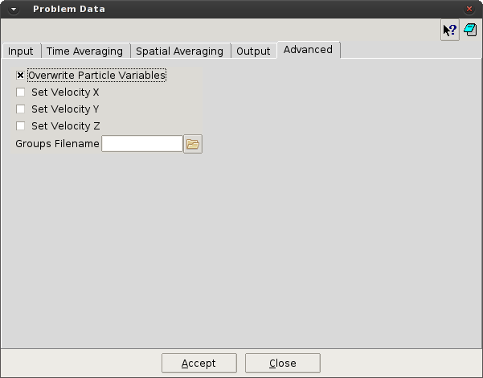

# Advanced

This section give access to advanced features of P4, like overwrite particle variables or groups.

* **Overwrite Particle Variables.** [on/off] Allows the user to overwrite certain variables from the particle
files. At the moment, just the velocity can be overwritten.

* **Set Velocity_[X,Y,Z].** [on/off] When Overwrite Particle Variables is activated, allows the user to chose
the component of the velocity vector to be overwritten.

* **Velocity_[X,Y,Z].** When Overwrite Particle Variables is activated, the value of the velocity used to
overwrite this velocity component.

* **Groups Filename.** Define a file used to overwrite the particles group-ID in the particles file.