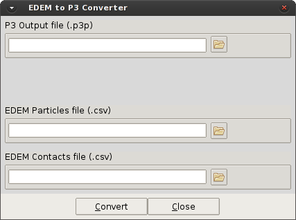
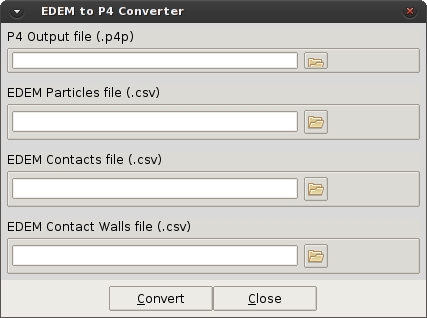

# Toolbox

This option give access to the user to different tools defined for the pre-process. Currently just the
converter from EDEM exported files to P4 file format are available.

* **Convert: EDEM to P3**
* **Convert: EDEM to P4**

The main difference between each option is related with the use of non-spherical particles in the
simulation. The previous version of the file format (P3 format) assume spherical particles in the DEM
simulation, while the new version (P4 format) allows the use of non-spherical particles, providing extra
information in the contact files, through the use of a API mechanism in EDEM. For more details, please
see Appendix A for the converters, and Appendix D for the explanation of the different file formats in
P4.

**EDEM converter for spherical particles:**

**EDEM converter for non-spherical particles:**

