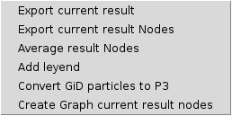
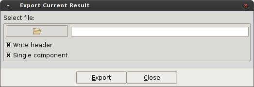
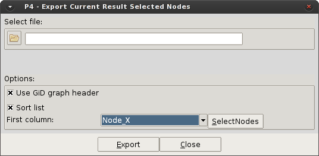
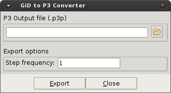
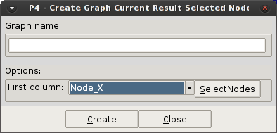

# Toolbox for analytics

This option display the list of available tools to export/manipulate results defined for the post-process.

  

* **Export current result.** This option export in a plain text the coordinates and the selected result for each node in the mesh.

  

* **Export current result nodes.** This option exports in a plain text a chosen coordinate/ID and the selected result for a group of nodes in the mesh.

  

* **Average result nodes.** The option calculates the average value for the selected result in a user defined group of nodes.
The results shown are: Number of nodes for the average, the average value, and the standard deviation of the value.

* **Add legend.** Display the Comment windows to visualize a legend with the present result.
(To see the detailed list of options available in GiD help: `Help > General Aspects > Utilities Menu > Tools > Comments > Postprocessing`)

* **Convert GiD particles to P4.** The option write a P4 file with the particle information using the P3/P4 format.
This is useful to process old simulations available in GiD post-process format.

  

* **Create Graph current result nodes.** The option generate a graph with a defined group of nodes for the current result, over a chosen coordinate/node-ID.
Similar to *[Export current result nodes]*, but sending the information to the graph buffer without write a file.

  
