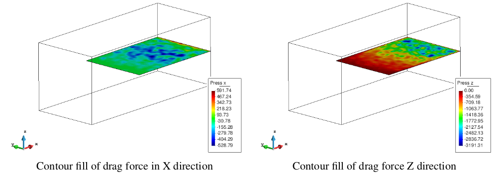

# Visualizing averaged results

After the model is processed and the P4 output files are generated, the standard visualization capabilities
of GiD can be used, together with a set of special tools and commands specific of P4 for the analysis of
the results.

The output file can load the particles in the *Load post-process file* section of the toolbar (with GiD in
post-process mode).

Ones the file is loaded, the different meshes used in the process will appear in the Display Style window.
To visualize the averaged results, the toolbar *View Results Menu* can be used (`Menu > View results`), or through the Results Window [].

Based in the same previous example of particle visualization, the figure below depicted the density
projected over a 3D volumetric mesh (Tetrahedra) and a fine 3D surface mesh (triangles) as a slice (XZ)
in the middle of the domain.

The interior of the volumetric mesh can be visualized through cut planes defined over different directions:

* `Menu > Do cuts > Cut plane > Succession`.

* Define the cutting axis by two points. Enter first point: *(0.0 -0.2 0.0)*, and second point: *(0.0 0.2 0.0)*.

* Enter the number of cut surfaces along the defined line: 4. Each cut surface will appear as a different
  layer in *Display Style* window, and can be visualized deactivating the volume mesh ().

  

* Activating again the volumetric mesh and deactivating the cuts, it is possible generate new cuts in a different direction

* Selecting a new set of successions in direction Z. First point: *(0.0 0.0 -0.2)*, second point: *(0.0 0.0 0.2)*, and 4 cut surfaces.

  

## Graphs

To analyze the results in the mesh, graphs can be generated for the temporal evolution of a variable in a
defined point or the spatial distribution of a certain variable.
The generation of a graph with the temporal evolution of a variable in a predefined point can be performed
by:

* `Menu > View results > Graphs > Point evolution > Variable (density)`.

* Enter the coordinates of the point: *(0.3 0.0 0.05)*. More points can be entered or *ESC* to finish.

  

In a similar way, the spatial distribution of a variable in a defined direction can be plotted:

* Set the spatial direction in X axis: `Menu > View results > Graphs > Line graph > Set X axis > Z variation`.

* Set the variable to plot: `Menu > View results > Graphs > Line graph > Variable (density)`.

* Enter the initial point of the plot: *(0.3 0.0 -0.2)*, and the second point: *(0.3 0.0 0.2)*. More points can be entered or *ESC* to finish

  

The graphs can be modified using the options in the Graph window, or can be used a more specialized software (like MS Excel or Matlab),
exporting the graphs as 2 columns ascii files: `Menu > File > Export > Graph` and select the graph to export, or export all the graphs in the screen.

> NOTE:
> 
> * Explain something about the Integral 1D or 2D visualization...

## Pressure/drag force in surfaces

When the user define physical surfaces (geometries), the pressure and drag forces over those surfaces
will be calculated during the precessing.

For the previous example, if the condition is applied for the surface in the middle of the domain (the
conveyor), the drag forces and pressure will appear in the results menu. In the figure below, the resultant
drag force in X and Z directions are depicted.

## Integrals

The calculation of the integrals in a direction (1D) or a plane (2D) can be specially useful in certain
situations, like the calculation of mass or volumetric flow rate. Other case in which the integral can be
used is the calculation of the average values in a certain direction when the results should be uniformlly
distributed. For this, the averaged results can be projected over a surface, decreasing the amount of
information required.

With the previous example, the average density over the Y direction is calculated following as:

* Activate the integral in Axis-Y. In the *P4 Options: Spatial_Integral = 1D*, and *Integral_direction = Y*.

* In Output options: Scale Results = yes and Scale Value = 1/L (L is the length in Y direction).

* Generate a geometry (surface) over the plane XZ, considering the dimensions of the domain (the
position of the surface in the Y direction is not relevant and any value can be used).

The results of the simulation now can be defined as *<ρ>_y*, as presented in the figure

