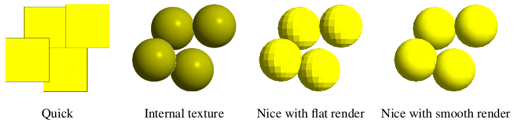

# Change View Mode

Change the view mode/rendering for particles visualization. GiD have the ability to use different
rendering techniques for the particle visualization. This option automatically change between: Internal
Texture, Nice and Quick.
For further details, please check the GiD help: `Help > Postprocessing > Options Menu > Geometry > Sphere options`.

> NOTE:
> * The recommended view mode for large models is Internal Texture.
> The Nice view mode should be reserved for small models or special cases due to the high computational cost involved in the rendering.
> 
> * When Nice view mode is activated, the render mode can be changed in: `Menu > View > Render`, or with the Mouse Menu (right button) and Render.