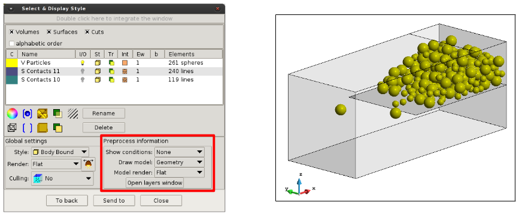
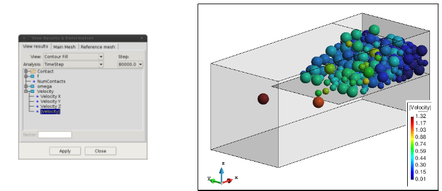
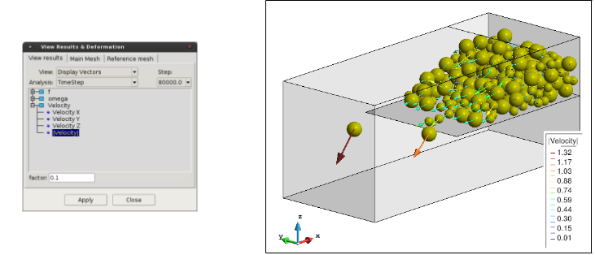
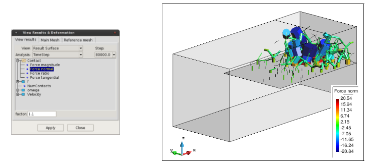

# Visualizing particles

After activate *Print Particles* in the OUTPUT options of P4 and run the P4 processing, the user can
load the particles in the *Load post-process file* section of the toolbar (with GiD in post-process mode).
The files containing the particles, and optionally the contacts, have the extension .particles after the user
defined name.

By default, the Internal-texture visualization mode is activated and both, particles and contacts, are
plotted in the screen. The control for activate/deactivate, transparencies and style for the different groups
of particles or contacts, the Display Style windows of GiD can be used [].
The particles file just contain the information of particles and contacts, and no information of geometry
is stored.

If the geometry or mesh is required in the visualization of the particles, the option *Draw model* in Display Style can be used.
This requires to have loaded the geometry/mesh in the pre-processor and transparency/deactivation for the geometry are available
through the *Open layer window*.

To visualize the particle results, the toolbar *View Results Menu* can be used (`Menu > View results`), or through the *Results Window* [].

The visualization of the Force Chain with the particle contacts can be performed using the result option *Result Surface*.
Please be sure that the contacts are activated for visualization and the particles are deactivated or with transparency.

For more details about the visualization options and capabilities, please check the GiD help in: `Help > Postprocessing > View Results Menu`.
